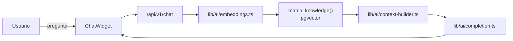

# MercadoTech

Marketplace de compra/venta de productos tecnológicos con búsqueda
semántica y un asistente de soporte conversacional (RAG) construido sobre
Next.js 15 y Supabase.

**Producción:** https://mercadotech-kohl.vercel.app

## Qué hace

* Catálogo con ficha técnica normalizada, filtros por categoría e historial
  de precios ("Bajaron de precio esta semana").
* Cuentas de comprador y vendedor: carrito, checkout simulado, pedidos con
  estados (`pendiente → pagado → enviado → entregado`, o `cancelado`).
* Panel de vendedor: publicar productos con galería de imágenes ordenable
  (drag & drop) y un kanban de pedidos (arrastrable con mouse o teclado).
* Asistente de IA flotante en toda la tienda, en dos modos: **Comprar**
  (recomienda productos por búsqueda semántica) y **Soporte** (responde
  citando artículos reales de la FAQ).

## Stack

* **Next.js 15** (App Router, Turbopack) + **React 19** + **TypeScript**.
* **Tailwind CSS v4** + componentes **shadcn/ui** sobre **Base UI**
  (no Radix — ver convenciones en `CLAUDE.md`).
* **Supabase**: Postgres con RLS en todas las tablas, Storage, Auth,
  **pgvector** para búsqueda semántica.
* **Hugging Face Inference** (`@huggingface/inference`) para embeddings y
  generación de texto — un modelo gratuito, sin costo de API propio.
* **Vitest** (unitarios) + **Playwright** (E2E) + **GitHub Actions** (CI).
* Desplegado en **Vercel** vía integración nativa con GitHub (sin CLI).

## Arquitectura, en una línea por capa

```
components/  →  hooks/  →  services/  →  lib/supabase/  →  Supabase (RLS)
```

Un solo camino de datos: los componentes nunca llaman a `services/` ni a
`lib/supabase/` directamente, y `lib/ai/` (el único código que conoce la
API de Hugging Face) nunca lo importa un componente cliente. Detalle
completo — esquema, RLS, RAG, testing y deploy — en
[`docs/ARQUITECTURA.md`](docs/ARQUITECTURA.md).



## Puesta en marcha local

Requisitos: Node 22+, npm, [Docker](https://www.docker.com/) (para el
stack local de Supabase), y un token de
[Hugging Face](https://huggingface.co/settings/tokens) con el permiso
"Make calls to Inference Providers".

```bash
# 1. Instalar dependencias
npm install

# 2. Levantar Supabase local (aplica migraciones + siembra datos de prueba)
npx supabase start
npx supabase db reset

# 3. Variables de entorno
cp .env.example .env.local
# Completar con la URL/claves que imprime `supabase start`
# (API URL, anon key, service_role key) + tu HUGGINGFACEHUB_API_TOKEN

# 4. Servidor de desarrollo
npm run dev
```

Abre http://localhost:3000. Usuarios de prueba (`supabase/seed.sql`):
`buyer1@mercadotech.test` / `seller1@mercadotech.test`, contraseña
`MercadoTech123!`.

## Comandos

```bash
npm run dev          # servidor de desarrollo (Turbopack)
npm run build        # build de producción
npm run start        # sirve el build de producción
npm run lint         # ESLint
npm run type-check   # next typegen && tsc --noEmit
npm run test         # Vitest (unitarios)
npm run test:coverage  # Vitest con reporte de cobertura
npm run test:e2e     # Playwright — requiere Supabase local arriba
npm run db:types     # regenera types/database.ts desde el proyecto remoto
```

## Testing

* **Unitarios** (`npm run test`): 204 tests sobre `services/`, `hooks/` y
  `lib/`. El cliente de Supabase se inyecta por parámetro — nunca se
  mockea el módulo (`lib/ai/` es la única excepción).
* **E2E** (`npm run test:e2e`): 24 tests (8 flujos × 3 navegadores) contra
  Supabase local. Requiere `npx supabase start && npx supabase db reset`
  antes de cada corrida completa.
* El gate de cierre de cualquier cambio es
  `npm run lint && npm run type-check && npm run test` (+ `test:e2e` si el
  stack local está arriba) — ver la norma completa en `CLAUDE.md`.
* CI (`.github/workflows/ci.yml`) corre exactamente ese mismo gate en cada
  push/PR, sin ningún secreto (usa un Supabase efímero). Es requisito para
  poder mergear a `main`.

Si algo falla, [`docs/DEBUGGING.md`](docs/DEBUGGING.md) tiene el catálogo
de errores típicos con su mensaje literal y el primer paso para
diagnosticarlo.

## Despliegue

Vercel está conectado al repositorio de GitHub por su integración nativa:
cada push a `main` redespliega producción, cada PR levanta un preview con
URL propia. Nada de esto pasa por la CLI de Vercel ni por GitHub Actions —
las variables de entorno se cargan a mano en el dashboard de Vercel.

Guía completa (qué variable vive dónde, cómo se demuestra el flujo
PR → CI → preview → merge, y el plan de rollback) en
[`docs/DEPLOY.md`](docs/DEPLOY.md).

## Estructura del proyecto

```
app/                Rutas (App Router): (auth), (shop), (seller), api/v1
components/         UI por dominio + components/ui (shadcn/ui)
hooks/              Estado de cliente — llaman a services/, nunca a Supabase directo
services/           Lógica de negocio — SupabaseClient inyectable
lib/supabase/       Únicos archivos que instancian un cliente de Supabase
lib/ai/             Único lugar que conoce la API de Hugging Face
lib/validators/     Validación framework-agnóstica
lib/constants/      Tunables centralizados (roles, límites, estados)
types/              Tipos de dominio + database.ts (generado)
supabase/           Migraciones (fuente de verdad del esquema), seed, RLS
e2e/                Specs y Page Objects de Playwright
docs/               Arquitectura, bitácora, debugging, performance, deploy
```

Convenciones de código y reglas de capas completas en [`CLAUDE.md`](CLAUDE.md).
