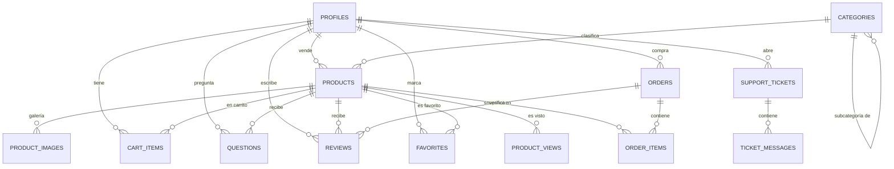
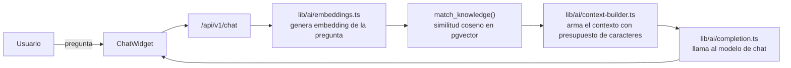

# Arquitectura de MercadoTech

Las secciones 1-10 describen la infraestructura construida en la Sesión 2
(base de datos, RLS, Storage) — siguen siendo la fuente de verdad del
esquema y no se reescriben aquí. Las secciones 11+ agregan las capas que se
construyeron después (frontend, RAG, testing/CI, deploy) — documentan lo
que el código REALMENTE tiene hoy, no lo que el plan original de cada
sesión asumía.

## 1. Arquitectura general y capas

MercadoTech sigue una arquitectura por capas con un único camino de datos:

```
UI (components) → hooks (estado de cliente) → services (lógica de negocio)
                                                     ↓
                                        lib/supabase (client/server/admin)
                                                     ↓
                                       Supabase (Postgres + RLS + Storage)
```

No existe una API REST paralela para operaciones que el frontend puede hacer
directo contra Supabase: `app/api/v1/` solo aloja Route Handlers para lo que
**no puede** ejecutarse en el navegador (llamadas a proveedores de IA con
secretos, operaciones con el cliente `admin` de service role, etc.). Esta
regla evita el problema detectado en ReadHub, donde quedó una API v1 completa
que el frontend nunca llegó a usar.

Principio rector: **independencia de funciones, módulos y componentes**. Cada
capa tiene una responsabilidad única y no conoce los detalles internos de las
capas que no le corresponden:

- `components/` — presentación pura. Reciben props, no hacen fetching, no
  conocen Supabase.
- `hooks/` — estado de cliente. Llaman a `services/`, cero lógica de negocio
  propia.
- `services/` — lógica de negocio. Cada función acepta un `SupabaseClient`
  inyectable (default: cliente de navegador), de modo que hooks y Route
  Handlers reutilizan la misma lógica y los tests la mockean sin red.
- `lib/supabase/` — los únicos archivos que instancian clientes de Supabase.
- `lib/ai/` — los únicos archivos que conocerán la API del proveedor de IA
  (sesión 4). La UI nunca los importa directamente.
- `lib/voice/` — los únicos archivos que conocerán la API de voz del
  navegador/proveedor (sesión 8). La UI nunca los importa directamente.
- `lib/validators/` — validación framework-agnóstica, compartida entre UI y
  servidor.
- `lib/constants/` — todos los tunables (roles, estados, límites) centralizados.

Reglas derivadas que aplican a todas las sesiones siguientes:

1. Un archivo, una responsabilidad (`product.service.ts` no sabe de pedidos).
2. Sin barrels: se importa el archivo específico, nunca "todo el módulo".
3. La UI nunca importa `lib/ai/`, `lib/voice/` ni `lib/supabase/admin.ts`.
4. Un solo camino de datos: hooks → services → Supabase (RLS).
5. Todo tunable vive en `lib/constants/`.

## 2. Organización de carpetas

```
app/
├── (auth)/          # login, register — sesión 3
├── (shop)/           # catálogo, producto, carrito, pedidos — sesión 3
├── (seller)/          # panel del vendedor — sesión 3
└── api/v1/             # Route Handlers server-only — sesiones 3-4
components/             # presentación pura
hooks/                   # estado de cliente
services/                 # lógica de negocio (cliente inyectable)
lib/
├── supabase/               # client.ts, server.ts, middleware.ts, admin.ts
├── validators/
├── constants/
├── ai/                        # sesión 4
├── voice/                      # sesión 8
└── utils.ts
types/                           # tipos de dominio + database.ts (generado)
supabase/
├── migrations/                    # fuente de verdad del esquema
├── schema.sql                       # referencia (NO fuente de verdad)
├── policies.sql                      # referencia (NO fuente de verdad)
├── seed.sql
└── tests/                              # validación RLS
docs/
```

## 3. Modelo relacional



Todas las tablas viven en el esquema `public` y referencian `profiles.id`
(1:1 con `auth.users.id`), nunca `auth.users` directamente, para mantener el
esquema de dominio desacoplado del esquema interno de Auth.

## 4. Decisiones de diseño

- **Snapshots en `order_items`** (`title_snapshot`, `price_snapshot`): si el
  vendedor edita o borra un producto después de una venta, el historial del
  pedido no cambia. Es la única forma de tener un histórico de compras
  confiable.
- **`seller_id` denormalizado en `order_items`**: sin este campo, las
  políticas RLS que permiten a un vendedor ver "los pedidos que contienen sus
  productos" requerirían un JOIN adicional contra `products` en cada
  evaluación de política, con el riesgo de que un producto borrado rompa la
  visibilidad del histórico. Denormalizarlo lo hace estable y más barato de
  evaluar.
- **Checkout como función transaccional** (`create_order_from_cart`): evita
  condiciones de carrera entre validar stock y descontarlo (usa
  `for update` para bloquear las filas de `products` involucradas dentro de
  la transacción) y garantiza que crear el pedido, sus ítems, el descuento de
  stock y el vaciado del carrito ocurran atómicamente. El cliente nunca
  inserta en `orders`/`order_items` directamente: la única vía es esta
  función `SECURITY DEFINER`, con `execute` revocado a `public`/`anon` y
  otorgado solo a `authenticated`; internamente valida que
  `p_buyer_id = auth.uid()` para que un usuario no pueda generar pedidos a
  nombre de otro.
- **`product_views` como tabla de eventos, no como contador**: cada apertura
  de producto inserta una fila en lugar de incrementar un contador en
  `products`. Esto evita contención de escritura sobre la fila del producto
  en picos de tráfico y permite análisis futuro (vistas por período, vistas
  únicas, etc.) sin perder granularidad.
- **Protección de `profiles.role` vía trigger**: RLS por sí solo no puede
  comparar el valor anterior y nuevo de una columna en una misma política de
  forma directa y legible; se usa un trigger (`protect_profile_role`) que
  aborta la transacción si `role` cambia y quien ejecuta la actualización no
  es admin.
- **Funciones helper `is_admin()` / `is_seller()`** (`SECURITY DEFINER`,
  `search_path` fijado): evitan repetir la subconsulta a `profiles` en cada
  política y previenen "confused deputy" al fijar el `search_path`.

## 5. Integración Next.js ↔ Supabase

- `lib/supabase/client.ts` — `createBrowserClient` de `@supabase/ssr`, usa
  `NEXT_PUBLIC_SUPABASE_ANON_KEY`. Respeta RLS con la sesión del navegador.
- `lib/supabase/server.ts` — `createServerClient` con cookies de
  `next/headers`, para Server Components/Actions/Route Handlers. Respeta RLS
  con la sesión del usuario autenticado en esa request.
- `lib/supabase/admin.ts` — cliente con `SUPABASE_SERVICE_ROLE_KEY`, bypasea
  RLS por completo. Solo se importa desde código server-only que lo necesite
  explícitamente; nunca desde `components/`, `hooks/` ni `services/`
  genéricos.
- `lib/supabase/middleware.ts` + `middleware.ts` (raíz) — refrescan el token
  de sesión en cada request siguiendo el patrón oficial de `@supabase/ssr`.

## 6. Flujo de autenticación

1. El usuario se autentica (sesión 3 implementará las pantallas); Supabase
   Auth emite tokens de acceso/refresco almacenados en cookies HttpOnly.
2. `middleware.ts` intercepta cada request, llama a `updateSession` y
   refresca el token si está por expirar, antes de que la petición llegue a
   cualquier Server Component o Route Handler.
3. Al crearse el usuario en `auth.users`, el trigger `handle_new_user` crea
   automáticamente su fila en `public.profiles` con `role = 'buyer'` por
   defecto.
4. Los Server Components leen la sesión vía `lib/supabase/server.ts`
   (cookies), y toda consulta subsecuente queda automáticamente filtrada por
   RLS según `auth.uid()`.

## 7. Estrategia de escalabilidad

- **Índices** en todas las columnas usadas como filtro de RLS o de consultas
  frecuentes (`seller_id`, `category_id`, `is_active`, `buyer_id`,
  `product_id`, etc. — ver migraciones para el listado completo).
- **`(select auth.uid())`** en vez de `auth.uid()` suelto dentro de las
  políticas RLS: Postgres cachea el resultado de la subconsulta por
  statement en lugar de re-evaluar la función una vez por fila.
- **Funciones `SECURITY DEFINER` con `search_path` fijado** para las
  políticas que necesitan consultar `profiles` (`is_admin`, `is_seller`),
  evitando repetir el mismo JOIN/subconsulta de forma inline en cada policy.
- **Paginación**: quedará resuelta a nivel de `services/` en la sesión 3
  (rangos con `.range()` de PostgREST); el esquema no impone límites que la
  bloqueen.
- **pgvector para búsqueda semántica** se añadirá en la sesión 4 sin tocar
  las tablas existentes (columna `embedding` nueva en `support_articles` y/o
  `products`, según se defina en esa sesión).

## 8. Políticas RLS por tabla

Fuente de verdad: `supabase/migrations/20260101000015_rls_policies.sql`
(copia de referencia en `supabase/policies.sql`). Resumen:

| Tabla | SELECT | INSERT | UPDATE | DELETE |
|---|---|---|---|---|
| `profiles` | dueño o admin | — (trigger `handle_new_user`) | dueño; `role` protegido por trigger `protect_profile_role` | — |
| `categories` | todos (anon incluido) | admin | admin | admin |
| `products` | activos para todos; el vendedor ve también los suyos inactivos | vendedor (`seller_id = auth.uid()` y `is_seller()`) | vendedor dueño | vendedor dueño |
| `product_images` | igual que su producto | vendedor dueño del producto | vendedor dueño del producto | vendedor dueño del producto |
| `cart_items` | dueño | dueño | dueño | dueño |
| `orders` | comprador dueño, vendedor con ítems propios, o admin | — (solo vía `create_order_from_cart`) | vendedor avanza `status` de pedidos con ítems suyos; comprador solo cancela si `pendiente` | — |
| `order_items` | comprador del pedido, vendedor de sus ítems, o admin | — (solo vía función) | — | — |
| `questions` | todos | cualquier `authenticated` (como autor) | vendedor dueño del producto (para `answer`) | autor o admin |
| `reviews` | todos | comprador con pedido `entregado` que contenga el producto | autor | autor o admin |
| `favorites` | dueño | dueño | — | dueño |
| `product_views` | vendedor del producto o admin | cualquier `authenticated` (como autor del evento) | — | — |
| `support_articles` | todos si `is_published` | admin | admin | admin |
| `support_tickets` | dueño o admin | dueño | dueño (solo puede cerrar) o admin (cualquier campo) | — |
| `ticket_messages` | dueño del ticket o admin | dueño del ticket o admin | — | — |

Cada política evalúa `(select auth.uid())` para el actor actual y usa
`is_admin()` / `is_seller()` donde corresponde verificar el rol. Los GRANTs
de la Data API (`anon`/`authenticated`) están alineados exactamente con esta
tabla: sin el GRANT correspondiente, PostgREST devuelve error aunque la
policy sea correcta (lección de ReadHub).

## 9. Storage

- **`product-images`** (lectura pública): escritura/borrado solo del
  vendedor autenticado, dentro de `{seller_id}/{product_id}/{n}.{ext}`.
- **`avatars`** (lectura pública): escritura/borrado solo del dueño, dentro
  de `{user_id}/...`.
- Ambos buckets limitan tipos MIME a imágenes y tamaño máximo a 5 MB.
- Las políticas comparan `(storage.foldername(name))[1]` (primer segmento de
  la ruta) contra `auth.uid()`.

## 10. Estado conocido / próximos pasos

- `seed.sql` referencia rutas de imágenes en Storage que no existían como
  archivos reales hasta que se subieron desde la UI (sesión 3) o, para el
  catálogo de producción, por script (ver §14).
- Las secciones 11-14 cubren lo construido después de la sesión 2.

## 11. Frontend (Sesión 3)

Mapa de rutas real (`app/`):

```
(auth)/   login, register
(shop)/   / (Home), /categoria/[slug], /buscar, /producto/[id], /favoritos,
          /carrito, /pedidos, /pedidos/[id], /comparar
(seller)/ /vendedor/productos, /vendedor/publicar,
          /vendedor/productos/[id]/editar, /vendedor/pedidos
```

`(shop)/layout.tsx` monta `Navbar` (con `UserMenu`, `CartIndicator`,
`CategoriesMenu`) y `ChatWidget`; `(seller)/layout.tsx` monta
`SellerSidebar` en su lugar — **no comparten navbar**, algo que costó un
bug real de E2E hasta que se verificó (BITACORA, Sesión 6, problema 9: no
hay botón "Menú de..." en ninguna ruta `/vendedor/*`).

El Home fue rediseñado por completo antes de la Sesión 6 (commits
`d5220af`/`d9d0543`/`bd8ae49` — tema oscuro, tipografía Manrope/IBM Plex
Sans, verde de marca) y **ya no lista todo el catálogo**: solo muestra dos
secciones curadas, "Bajaron de precio esta semana" (`previous_price` no
nulo) y "Mejor calificados" (productos con reseñas). El catálogo completo
navegable vive en `/categoria/[slug]` y `/buscar`.

Kanban de pedidos del vendedor: `@dnd-kit/core` con `PointerSensor` +
`KeyboardSensor` (foco en el asa → `Space` levanta → flechas mueve → `Space`
suelta) — el camino de teclado es el que se usa en los tests E2E, no el
mouse (BITACORA, Sesión 6, decisión 9).

## 12. RAG / IA conversacional (Sesión 4)



* `knowledge_embeddings` (pgvector, `vector(384)`, índice HNSW) guarda
  chunks de `products` y `support_articles`, discriminados por
  `source_type`. Cambiar de modelo de embeddings exige migrar la dimensión
  de la columna — no basta con cambiar la variable de entorno (comentario
  en la migración `20260101000022`).
* `lib/ai/` es el ÚNICO lugar que conoce la API de Hugging Face
  (`@huggingface/inference`, `featureExtraction` para embeddings — el
  router OpenAI-compatible de HF no soporta `feature-extraction`).
  Verificado (Fase 7.2, `docs/PERFORMANCE.md`): ningún componente cliente
  lo importa, ni siquiera con `import type`.
  Se llama solo desde `app/api/v1/chat` — nunca desde el navegador
  directo, porque `HUGGINGFACEHUB_API_TOKEN` es secreta (§ variables en
  `docs/DEPLOY.md`).
* Indexación automática: trigger de Postgres + `app/api/v1/reindex` +
  `scripts/index-all.ts` para una corrida manual completa.
* Dos modos de chat (`ChatMode`): `compras` (recomienda productos) y
  `soporte` (responde con la FAQ) — mismo componente `ChatWidget`, dos
  system prompts distintos en `lib/ai/prompts.ts`.

## 13. Testing y CI (Sesión 6)

* Unitarios (Vitest, `environment: "node"`): `services/*.test.ts` inyectan
  el `SupabaseClient` por parámetro — nunca `vi.mock` de `lib/supabase/*`;
  `lib/ai/*` es la única excepción mockeada por módulo. 204 tests, 21
  archivos.
* E2E (Playwright, 24 tests = 8 specs × 3 navegadores): Page Objects en
  `e2e/pages/`, fixtures de login en `e2e/fixtures/test.ts`. Requieren
  `supabase start && supabase db reset` — nunca corren contra el proyecto
  remoto.
* CI (`.github/workflows/ci.yml`): job `checks` (lint + type-check + tests,
  ~40 s) y job `e2e` (Supabase efímero + Playwright chromium, ~4 min), sin
  ningún secreto — las claves del stack local no protegen nada real. Ambos
  son *required status checks* del ruleset de `main` (§ `docs/DEPLOY.md`).
* Sesión 6 encontró y corrigió 2 bugs reales de producción invisibles hasta
  entonces (el menú de usuario rompía con un Runtime Error de Base UI, y
  "Cerrar sesión" no ejecutaba nada por un `onSelect`/`onClick` mal usado)
  — detalle completo en `docs/BITACORA.md`.

**Nota:** el plan maestro original preveía una "Sesión 5" (Skills de
gobernanza + servidor MCP) entre la 4 y la 6. Verificado contra el
historial real de este repo: **esa sesión nunca se ejecutó aquí** — no
existe carpeta `mcp/`, y las únicas Skills reales son `analista-negocio`,
`planificacion-por-fases` y `web-scraping` (ninguna relacionada con
gobernanza del propio proyecto). Se documenta la ausencia en vez de
inventar contenido para una fase que no ocurrió.

## 14. Despliegue (Sesión 7)

* **Producción:** `https://mercadotech-kohl.vercel.app`, desplegada desde
  GitHub por la integración nativa de Vercel (sin CLI, sin tokens en
  Actions) — cada push a `main` redespliega producción; cada PR levanta un
  preview con URL propia.
* **Base de datos:** el mismo proyecto Supabase de desarrollo
  (`uuvgafxscvukrlzirmao`) sirve también producción — decisión consciente
  documentada en `docs/DEPLOY.md` §2 (desviación de la spec original, que
  asumía un proyecto separado con seed mínimo).
* **Secretos:** cargados a mano en el dashboard de Vercel, nunca en el
  repo ni en GitHub Actions — tabla completa de qué variable vive dónde en
  `docs/DEPLOY.md` §1.
* **Candado de merge:** ruleset de GitHub sobre `main` exige PR +
  `checks`/`e2e` en verde antes de poder mergear (`docs/DEPLOY.md` §2).
* Performance: `docs/PERFORMANCE.md` — bundle medido con `next build`
  (Turbopack, sin bundle-analyzer), 3 `dynamic import` aplicados con
  medición antes/después.
